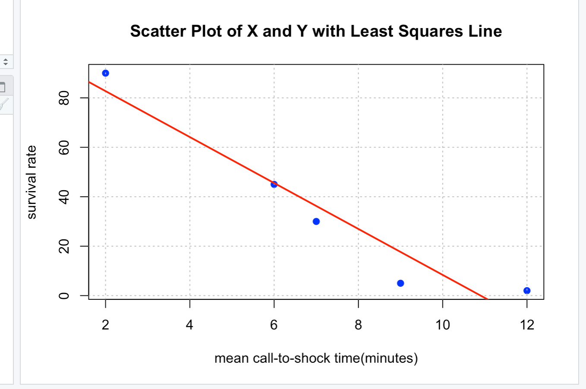

Studies have shown that people who suffer sudden cardiac arrest have a better chance of survival if a defibrillator shock is administered very soon after cardiac arrest. 
How is survival rate related to the time between when cardiac arrest occurs and when the defibrillator shock is delivered? This question is addressed 
in the paper “Improving Survival from Sudden Cardiac Arrest: The Role of Home Defibrillators” The accompanying data give = 5 survival rate (percent) 
and x = mean call-to-shock time (minutes) for a cardiac rehabilitation center (in which cardiac arrests occurred while victims were hospitalized and so the call-to-shock time tended 
to be short) and for four communities of different sizes:

Mean call-to-shock time, x: 2 6 7 9 12
Survival rate, y: 90 45 30 5 2

A. Construct a scatterplot for these data. How would you describe the relationship between mean call -to-shock time and survival rate?

The relationship between mean call-to-shock time and Survival rate is negative.

B. Find the equation of the least-squares line.

Using the provided Rscript to calculate the least sguares regression, the result are as follows:
-** Intercept (a): 101.3285 

-** Slope (b): -9.29562  
Thus, the least squares reqression equation is:
   y= ax+b 
   
   y= 101.33-9.30
C. Use the least-squares line to predict survival rate for a community with a mean call-to-shock time
of 10 minutes.

101.33 -9.30(10)=8.33

